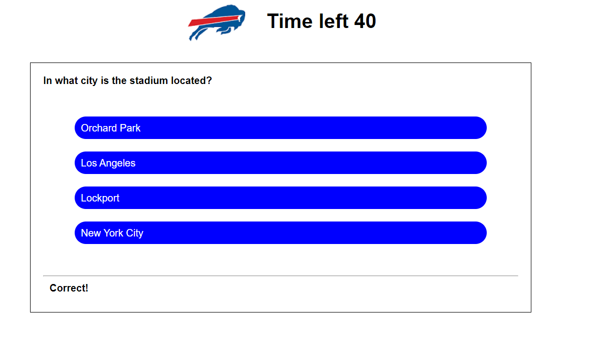

# Code Quiz

## Description

The purpose of this web site is to create a code quiz that uses the native Web APIs built into the browser for javascript.  This code quiz uses javascript to do the following:

- Move between different screen states
- Display a series of questions and possible answers using an array of objects
- Compare answers to the correct answer and give user feedback
- Count down a timer to generate a score
- Use event listeners and query selectors to send information to and from the website from the javascript file
- Write and extract data to local storage

## Table of Contents

- [Screenshots and Links](#screenshots)
- [Acceptance Criteria](#acceptance)
- [What I Learned](#learned)

## ScreenShots
Below is a screen shot of the page showing a question:

Below is a screen shot of the page showing the results:

The page is live on  [GitHub Pages](https://stephencurrie.github.io/hw-4-code-quiz/)

The code is in the  [GitHub Repository](https://github.com/stephencurrie/hw-4-code-quiz)

## Acceptance

The following were the acceptance criteria for the ticket:

- [x] When I click the start button, a timer starts and a question is presented
- [x] When an answer is provided, another question is displayed
- [x] When an incorrect answer is presented, extra time is taken off of the timer
- [x] The game is finished when the timer expires or all the questions are answered
- [x] When the game is finished, the score can be saved

## Learned

The following is a list of things I learned:
- How to present different screen states using data attributes
- How to cycle through a list of questions and answers using an array of objects
- How to use event listeners and query selectors to pass data back and forth between the index.html file and the javascript file
- How to build a timer that counts down 
- How to write key value pairs to local storage
- How to append to list elements by adding to an array

Our instructor, Trey Eckles, provided guidance on how to start building the different states.  He also provided some early code examples.

My tutor, Simon Rennocks, was instrumental in debugging and helping to write some of the code.